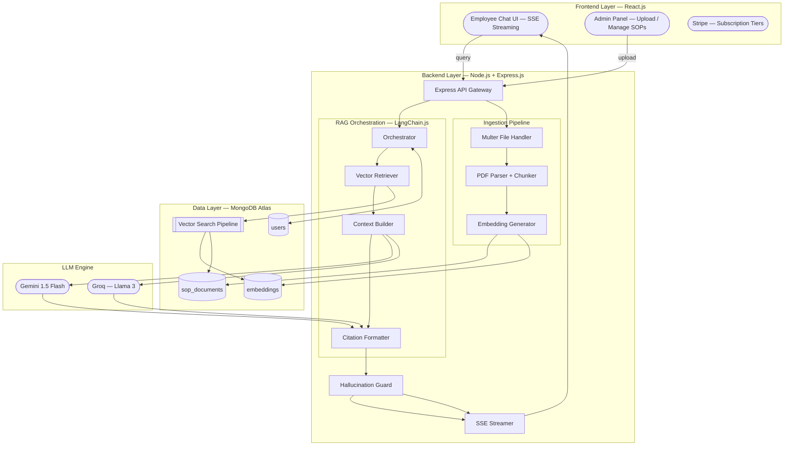

# OpsMind AI — Product Requirements Document

**Project:** Enterprise SOP Agent (Project 1)
**Product Brand:** OpsMind AI
**Codename:** Context-Aware Corporate Knowledge Brain
**Division:** Zaalima Development — AI Engineering & Full Stack
**Team:** Squadron Omega
**Author:** Lead AI Architect
**Date:** December 1, 2025
**Version:** 1.0.0
**Status:** Approved for Q4 Development

---

## Table of Contents

1. [Executive Summary](#1-executive-summary)
2. [Problem Statement](#2-problem-statement)
3. [Goals & Success Metrics](#3-goals--success-metrics)
4. [User Personas](#4-user-personas)
5. [System Architecture Overview](#5-system-architecture-overview)
6. [Functional Requirements](#6-functional-requirements)
7. [Non-Functional Requirements](#7-non-functional-requirements)
8. [Tech Stack Specification](#8-tech-stack-specification)
9. [Data Models](#9-data-models)
10. [API Specification](#10-api-specification)
11. [RAG Pipeline Design](#11-rag-pipeline-design)
12. [Week-Wise Implementation Plan](#12-week-wise-implementation-plan)
13. [Security & Compliance](#13-security--compliance)
14. [Deployment & Infrastructure](#14-deployment--infrastructure)
15. [Open Questions & Risks](#15-open-questions--risks)

---

## 1. Executive Summary

OpsMind AI is an enterprise-grade, AI-powered knowledge agent built to eliminate the friction of navigating dense, sprawling Standard Operating Procedure (SOP) documentation. Large corporations typically maintain hundreds of pages of SOPs buried in PDFs across shared drives. Employees waste significant time searching for answers — or worse, act on outdated or misremembered procedures.

OpsMind AI solves this by providing a conversational AI interface that can instantly answer any employee question by reading the live SOP knowledge base, citing the exact source (document, page, section), and explicitly refusing to fabricate answers when information is not found. It is built on the AI-MERN Hybrid Stack and follows a Retrieval Augmented Generation (RAG) architecture to ground all responses in verified company documentation.

---

## 2. Problem Statement

### Current Pain Points

- Employees spend significant time manually searching through hundreds of pages of SOP PDFs to find procedural answers.
- Knowledge is siloed — different departments maintain different documents with no unified query interface.
- New employees are especially affected, frequently asking the same procedural questions of senior staff, creating a productivity drain.
- Existing static search tools (keyword-based) fail to understand semantic intent, returning irrelevant results or none at all.
- No auditability: there is no record of what employees looked up, what answers they received, or whether the answers were accurate.

### The Opportunity

Retrieval Augmented Generation (RAG) makes it possible to build a system that combines the conversational fluency of a large language model with the precision of a searchable, up-to-date document index. The result is an agent that behaves like a perfectly-informed HR or compliance officer, available 24/7, with citations to back every claim.

---

## 3. Goals & Success Metrics

### Primary Goals

| Goal | Description |
|---|---|
| Accurate retrieval | Surface the correct SOP chunk for at least 90% of employee queries |
| Zero hallucination | The agent must never fabricate an answer not grounded in the knowledge base |
| Source citation | Every response must include document name, page number, and section reference |
| Fast response | End-to-end latency (query → first token streamed) under 3 seconds |
| Admin autonomy | Admins can upload, update, and delete SOPs without developer intervention |

### Key Performance Indicators (KPIs)

| Metric | Target |
|---|---|
| Query accuracy rate | ≥ 90% correct responses (human-evaluated) |
| Hallucination rate | 0% — agent must return "I don't know" when context is absent |
| RAG retrieval latency | ≤ 1.5s for vector search + chunk retrieval |
| First token to screen | ≤ 3s end-to-end |
| Admin upload-to-searchable | ≤ 60s from PDF upload to indexed and queryable |
| User satisfaction (CSAT) | ≥ 4.2 / 5.0 in internal pilot |

---

## 4. User Personas

### Persona 1 — The Employee (Primary User)

- **Name:** Riya, Operations Associate
- **Goal:** Quickly find the correct refund processing procedure without asking her manager
- **Behaviour:** Uses the chat interface to ask questions in natural language, expects instant and trustworthy answers
- **Pain point:** Currently spends 15–20 minutes per query navigating PDF folders
- **Tech comfort:** Moderate — comfortable with chat interfaces, not with document search tools

### Persona 2 — The Admin (Knowledge Manager)

- **Name:** Arjun, Compliance Manager
- **Goal:** Keep the SOP knowledge base up to date and ensure employees access accurate information
- **Behaviour:** Uploads updated PDFs whenever policies change, deletes outdated documents, monitors query logs
- **Pain point:** No current mechanism to push updated SOPs to a central, queryable system
- **Tech comfort:** High — comfortable with dashboards and file management tools

### Persona 3 — The Executive (Stakeholder)

- **Name:** Priya, COO
- **Goal:** Reduce time-to-answer for procedural queries and ensure compliance with documented SOPs
- **Behaviour:** Reviews usage dashboards and accuracy reports; evaluates ROI
- **Pain point:** Cannot currently measure whether employees follow documented SOPs

---

## 5. System Architecture Overview

### Layer Summary

```
┌─────────────────────────────────────────────┐
│         FRONTEND — React.js                 │
│  Chat UI (SSE)  │  Admin Panel  │  Auth UI  │
└────────────────────┬────────────────────────┘
                     │ HTTP / SSE
┌────────────────────▼────────────────────────┐
│         BACKEND — Node.js + Express         │
│  API Gateway → LangChain.js Orchestrator    │
│  PDF Ingestion Pipeline (Multer + Parser)   │
│  Context Builder → Citation Formatter       │
│  Hallucination Guard → SSE Streamer         │
└────────────────────┬────────────────────────┘
                     │ MongoDB Driver
┌────────────────────▼────────────────────────┐
│         DATA LAYER — MongoDB Atlas           │
│  users  │  sop_documents  │  embeddings     │
│       $vectorSearch Aggregation             │
└────────────────────┬────────────────────────┘
                     │ REST API
┌────────────────────▼────────────────────────┐
│         LLM ENGINE                          │
│  Gemini 1.5 Flash  OR  Groq (Llama 3)       │
└─────────────────────────────────────────────┘
```

### Data Flow — Employee Query

```
Employee types query
        │
        ▼
React Chat UI → POST /api/chat → Express Gateway
        │
        ▼
LangChain.js Orchestrator
        │
        ├──► $vectorSearch (MongoDB Atlas)
        │         │
        │         └──► Top 3–5 SOP chunks retrieved
        │
        ▼
Context Builder (query + chunks merged)
        │
        ▼
Gemini 1.5 Flash / Groq (Llama 3)
        │
        ▼
Citation Formatter → Hallucination Guard
        │
        ▼
SSE Streamer → token-by-token to React UI
```

### Data Flow — Admin PDF Upload

```
Admin uploads PDF via Admin Panel
        │
        ▼
POST /api/upload → Multer Handler
        │
        ▼
PDF Parser → text chunks (~1000 chars, 100 overlap)
        │
        ▼
Embedding Generator (Gemini / OpenAI Embed API)
        │
        ├──► sop_documents collection (chunks + metadata)
        └──► embeddings collection (vectors + doc_id FK)
```

---

## 6. Functional Requirements

### 6.1 Employee Chat Interface

| ID | Requirement | Priority |
|---|---|---|
| FR-01 | Employee can type any natural language question into the chat interface | P0 |
| FR-02 | The system must return an accurate, contextually grounded answer | P0 |
| FR-03 | Every answer must include a source citation (document name, page, section) | P0 |
| FR-04 | If no relevant SOP context exists, the agent must respond: "I don't have information on this in the current knowledge base." | P0 |
| FR-05 | Responses must stream token-by-token (typing effect) via Server-Sent Events | P0 |
| FR-06 | Chat history must be persisted per user session and accessible on reload | P1 |
| FR-07 | Clicking a source citation must open or highlight the relevant PDF snippet | P1 |
| FR-08 | Users must be able to start a new conversation / clear history | P2 |

### 6.2 Admin Knowledge Base Management

| ID | Requirement | Priority |
|---|---|---|
| FR-09 | Admin can upload one or multiple PDF files via the admin dashboard | P0 |
| FR-10 | Uploaded PDFs are automatically parsed, chunked, embedded, and indexed | P0 |
| FR-11 | Admin can view a list of all indexed documents with metadata (filename, upload date, page count, chunk count) | P1 |
| FR-12 | Admin can delete a document, which removes its chunks and embeddings from the index | P0 |
| FR-13 | Admin can trigger a manual re-index of any document | P1 |
| FR-14 | Admin panel is protected by role-based access control (RBAC) — only `admin` role users can access | P0 |

### 6.3 RAG Pipeline

| ID | Requirement | Priority |
|---|---|---|
| FR-15 | PDF text must be chunked at approximately 1000 characters with 100-character overlap to preserve context across chunk boundaries | P0 |
| FR-16 | Each chunk must be converted to a vector embedding using the configured embedding model | P0 |
| FR-17 | Vector search must retrieve the top 3–5 most semantically relevant chunks for any given query | P0 |
| FR-18 | Retrieved chunks must be ranked by relevance score before being passed to the LLM | P0 |
| FR-19 | The context window passed to the LLM must include: user query + retrieved chunks + citation metadata | P0 |

### 6.4 Authentication & Subscription

| ID | Requirement | Priority |
|---|---|---|
| FR-20 | Users must authenticate via email/password (JWT-based) | P0 |
| FR-21 | Stripe integration must support Free and Pro subscription tiers | P1 |
| FR-22 | Free tier: limited to N queries per day (configurable) | P1 |
| FR-23 | Pro tier: unlimited queries, access to chat history export | P1 |

---

## 7. Non-Functional Requirements

### Performance

| Requirement | Target |
|---|---|
| Vector search latency | ≤ 1.5 seconds |
| First token streamed to UI | ≤ 3 seconds from query submission |
| PDF upload → indexed and searchable | ≤ 60 seconds |
| Concurrent users supported | ≥ 100 simultaneous active sessions |

### Reliability

- System uptime: ≥ 99.5% (excluding planned maintenance)
- All services must restart automatically on failure (Docker restart policy: `always`)
- Failed embedding jobs must be logged and retried up to 3 times

### Scalability

- MongoDB Atlas horizontal scaling via sharding for embeddings collection
- Stateless backend services — horizontally scalable behind a load balancer
- SSE connections managed per-instance; sticky sessions required if multi-instance

### Security

- All API endpoints protected by JWT middleware
- Admin endpoints additionally protected by RBAC middleware
- File uploads: PDF only, max 50MB per file, virus-scanned before processing
- All secrets (API keys, DB URI, Stripe keys) stored in environment variables, never hardcoded
- GitHub webhook payloads validated via HMAC signature

### Accessibility

- Chat UI must meet WCAG 2.1 AA compliance
- Keyboard navigation supported throughout
- Screen reader compatible response rendering

---

## 8. Tech Stack Specification

### Frontend

| Component | Technology | Purpose |
|---|---|---|
| UI Framework | React.js 18 | Component-based UI rendering |
| State Management | Redux Toolkit or React Context | Chat history, user session, doc list |
| Streaming | Server-Sent Events (SSE) | Token-by-token response rendering |
| HTTP Client | Axios | API communication |
| Styling | Tailwind CSS | Utility-first responsive design |
| PDF Viewer | react-pdf | In-app PDF snippet viewer for citations |

### Backend

| Component | Technology | Purpose |
|---|---|---|
| Runtime | Node.js 20 LTS | Server runtime |
| Framework | Express.js | REST API + SSE endpoint handling |
| AI Orchestration | LangChain.js | RAG chain, prompt templates, retrieval logic |
| File Upload | Multer | Multipart PDF upload handling |
| PDF Parsing | pdf-parse or LangChain PDFLoader | Text extraction + chunking |
| Authentication | jsonwebtoken + bcrypt | JWT issuance and password hashing |
| Payment | Stripe Node SDK | Subscription management + webhooks |
| Validation | Zod | Request body validation |

### Data Layer

| Component | Technology | Purpose |
|---|---|---|
| Primary Database | MongoDB Atlas | Document storage + vector index |
| Vector Search | MongoDB Atlas Vector Search | Semantic ANN retrieval via $vectorSearch |
| ORM/ODM | Mongoose | Schema definition + query abstraction |

### LLM & Embeddings

| Component | Technology | Purpose |
|---|---|---|
| Primary LLM | Gemini 1.5 Flash (Google AI Studio) | Answer generation, multimodal reasoning |
| Alternate LLM | Groq API (Llama 3 70B) | Ultra-low-latency inference fallback |
| Embedding Model | Gemini text-embedding-004 or OpenAI ada-002 | Vector generation for chunks and queries |

### Infrastructure

| Component | Technology | Purpose |
|---|---|---|
| Containerisation | Docker + docker-compose | Environment parity across dev/staging/prod |
| Reverse Proxy | Nginx | SSL termination, static file serving |
| Process Manager | PM2 (inside container) | Node.js process management |
| CI/CD | GitHub Actions | Automated build, test, deploy pipeline |

---

## 9. Data Models

### Collection: `users`

```json
{
  "_id": "ObjectId",
  "email": "string (unique, indexed)",
  "password_hash": "string",
  "role": "enum: ['employee', 'admin']",
  "plan_tier": "enum: ['free', 'pro']",
  "stripe_customer_id": "string",
  "query_count_today": "number",
  "query_reset_at": "Date",
  "chat_history": [
    {
      "session_id": "string",
      "messages": [
        {
          "role": "enum: ['user', 'assistant']",
          "content": "string",
          "citations": ["{ doc_id, filename, page, section }"],
          "timestamp": "Date"
        }
      ]
    }
  ],
  "created_at": "Date",
  "updated_at": "Date"
}
```

### Collection: `sop_documents`

```json
{
  "_id": "ObjectId",
  "filename": "string",
  "original_name": "string",
  "uploaded_by": "ObjectId (ref: users)",
  "upload_date": "Date",
  "page_count": "number",
  "chunk_count": "number",
  "status": "enum: ['processing', 'indexed', 'error']",
  "chunks": [
    {
      "chunk_id": "string (uuid)",
      "chunk_index": "number",
      "text": "string",
      "page": "number",
      "section": "string",
      "char_start": "number",
      "char_end": "number"
    }
  ]
}
```

### Collection: `embeddings`

```json
{
  "_id": "ObjectId",
  "doc_id": "ObjectId (ref: sop_documents)",
  "chunk_id": "string (uuid)",
  "chunk_text": "string",
  "page": "number",
  "section": "string",
  "filename": "string",
  "vector": "[number] (1536-dim float array)",
  "embedding_model": "string",
  "created_at": "Date"
}
```

> **Vector Index Config (Atlas):**
> - Index name: `vector_index`
> - Field: `vector`
> - Dimensions: `1536`
> - Similarity: `cosine`
> - `numCandidates`: `100`, `limit`: `5`

---

## 10. API Specification

### Auth Endpoints

| Method | Endpoint | Description | Auth |
|---|---|---|---|
| POST | `/api/auth/register` | Register new user | Public |
| POST | `/api/auth/login` | Login, returns JWT | Public |
| POST | `/api/auth/refresh` | Refresh JWT token | Bearer |
| GET | `/api/auth/me` | Get current user profile | Bearer |

### Chat Endpoints

| Method | Endpoint | Description | Auth |
|---|---|---|---|
| POST | `/api/chat` | Submit query, returns SSE stream | Bearer |
| GET | `/api/chat/history` | Get paginated chat history | Bearer |
| DELETE | `/api/chat/history/:session_id` | Clear a specific session | Bearer |

**POST `/api/chat` — Request Body:**
```json
{
  "query": "How do I process a customer refund?",
  "session_id": "uuid (optional — creates new if absent)"
}
```

**POST `/api/chat` — SSE Response Events:**
```
event: token
data: {"text": "According"}

event: token
data: {"text": " to"}

event: citation
data: {"filename": "Refund_Policy_2025.pdf", "page": 12, "section": "3.1"}

event: done
data: {"session_id": "uuid", "total_tokens": 312}
```

### Admin / Document Endpoints

| Method | Endpoint | Description | Auth |
|---|---|---|---|
| POST | `/api/admin/upload` | Upload PDF(s) for indexing | Bearer + Admin |
| GET | `/api/admin/documents` | List all indexed documents | Bearer + Admin |
| DELETE | `/api/admin/documents/:doc_id` | Delete document + embeddings | Bearer + Admin |
| POST | `/api/admin/documents/:doc_id/reindex` | Re-embed and re-index a document | Bearer + Admin |

### Subscription Endpoints

| Method | Endpoint | Description | Auth |
|---|---|---|---|
| POST | `/api/billing/create-checkout` | Create Stripe checkout session | Bearer |
| POST | `/api/billing/webhook` | Stripe webhook handler | Stripe-Sig |
| GET | `/api/billing/portal` | Customer billing portal link | Bearer |

---

## 11. RAG Pipeline Design

### Step 1 — Ingestion

```
PDF File Received (via Multer)
        │
        ▼
pdf-parse: Extract raw text (preserve page numbers)
        │
        ▼
Chunker: Split into ~1000-char chunks
         Overlap: 100 chars
         Strategy: Split on sentence boundaries where possible
        │
        ▼
For each chunk:
  → Generate vector embedding via Gemini text-embedding-004
  → Write to sop_documents.chunks[]
  → Write to embeddings collection { vector, doc_id, chunk_id, page, section }
        │
        ▼
Update sop_documents.status = 'indexed'
```

### Step 2 — Retrieval

```
User Query: "What is the refund window?"
        │
        ▼
Generate query embedding (same model as ingestion)
        │
        ▼
MongoDB $vectorSearch:
  {
    index: "vector_index",
    queryVector: <query_embedding>,
    path: "vector",
    numCandidates: 100,
    limit: 5
  }
        │
        ▼
Return top-5 chunks ranked by cosine similarity score
```

### Step 3 — Generation

```
System Prompt Template:
────────────────────────────────────────────
You are OpsMind AI, a corporate knowledge assistant.
Answer the employee's question ONLY using the provided
SOP context. If the answer is not in the context,
respond with: "I don't have information on this in
the current knowledge base."

Always cite your source using this format:
"According to [filename], Page [X], Section [Y]..."

SOP Context:
{retrieved_chunks_with_metadata}

Employee Question:
{user_query}
────────────────────────────────────────────
        │
        ▼
Send to Gemini 1.5 Flash / Groq (Llama 3)
        │
        ▼
Stream response tokens via SSE
Attach citation metadata on [event: citation]
```

### Step 4 — Hallucination Guard

```
LLM Response received
        │
        ▼
Check: Does response contain grounded citations?
        │
        ├── YES → Pass to SSE Streamer
        └── NO  → Detected "I don't know" pattern
                  → Return safe fallback message
                  → Log query as "unanswered" for admin review
```

---

## 12. Week-Wise Implementation Plan

### Week 1 — Knowledge Ingestion (Upload & Embed)

**Goal:** Build the complete PDF → vector pipeline

| Task | Owner | Deliverable |
|---|---|---|
| Set up Node.js + Express project with Docker | Backend | Running containerised server |
| Implement Multer file upload endpoint | Backend | `POST /api/admin/upload` working |
| Integrate pdf-parse for text extraction | Backend | Raw text extracted per page |
| Build text chunker (1000 chars, 100 overlap) | Backend | Chunked array with metadata |
| Integrate Gemini embedding API | Backend | Vectors generated per chunk |
| Write chunks + vectors to MongoDB Atlas | Backend | Data visible in Atlas collections |
| Create Atlas Vector Search index | DevOps | `vector_index` active on embeddings collection |

**Verification:** Upload a 20-page SOP PDF. Confirm chunks, metadata, and vectors are correctly stored and the Atlas vector index shows the documents as indexed.

---

### Week 2 — Retrieval Engine (Finding the Needle)

**Goal:** Build semantic search that returns the right SOP chunks for any query

| Task | Owner | Deliverable |
|---|---|---|
| Implement `$vectorSearch` aggregation pipeline | Backend | Returns top-5 chunks by cosine similarity |
| Build query embedding generator | Backend | User query converted to vector on-the-fly |
| Build Context Window Builder | Backend | Merges query + retrieved chunks into prompt |
| Write LangChain.js RAG chain | Backend | End-to-end chain: query → retrieve → prompt |
| Unit test retrieval accuracy | QA | ≥ 90% correct chunk returned for test queries |

**Verification:** Query "How do I process a refund?" — confirm the correct policy chunk is returned as the top result, with correct page and section metadata.

---

### Week 3 — Chat Agent (Conversation & Streaming)

**Goal:** Deliver live, streaming, cited answers via the React UI

| Task | Owner | Deliverable |
|---|---|---|
| Integrate Gemini 1.5 Flash LLM into RAG chain | Backend | LLM generating grounded answers |
| Implement SSE endpoint (`/api/chat`) | Backend | Token-by-token stream over SSE |
| Build React Chat UI with SSE consumer | Frontend | Typing-effect response rendering |
| Implement Citation Formatter | Backend | Citations emitted as SSE events |
| Implement Hallucination Guard | Backend | "I don't know" returned for out-of-scope queries |
| Persist chat history to MongoDB | Backend | History survives page reload |

**Verification:** Rigorous hallucination testing — ask 10 questions not covered in the SOPs. All 10 must return the "I don't have information" response. Ask 10 covered questions — all 10 must return accurate, cited answers.

---

### Week 4 — UI Polish & Optimisation

**Goal:** Production-ready UX and performance hardening

| Task | Owner | Deliverable |
|---|---|---|
| Build citation viewer (click citation → PDF snippet) | Frontend | In-app PDF highlight via react-pdf |
| Build Admin Dashboard (doc list, upload, delete) | Frontend | Fully functional admin panel |
| Implement JWT auth + RBAC middleware | Backend | Auth protected across all endpoints |
| Integrate Stripe subscription (Free / Pro) | Full Stack | Working checkout + webhook |
| End-to-end performance profiling | QA | RAG latency ≤ 1.5s, first token ≤ 3s |
| Docker Compose production config | DevOps | `docker-compose.prod.yml` with Nginx |
| Stress test (100 concurrent users) | QA | No degradation under load |

**Verification:** Full end-to-end demo with a realistic 500-page SOP corpus. Performance, accuracy, and hallucination benchmarks must all pass before sign-off.

---

## 13. Security & Compliance

### Authentication & Authorisation

- JWT tokens expire after 24 hours; refresh tokens expire after 30 days
- Passwords hashed with bcrypt, minimum cost factor 12
- Admin routes protected by `requireAdmin` middleware (role check on JWT payload)
- Rate limiting: 60 requests/minute per IP on public endpoints; 10 requests/minute on `/api/chat` for Free tier users

### Data Security

- All data in transit: TLS 1.3 enforced via Nginx
- All data at rest: MongoDB Atlas encryption at rest enabled
- PDF files deleted from server filesystem after embedding (not stored permanently on the server)
- No SOP content is sent to external APIs beyond the LLM provider (Gemini / Groq)

### File Upload Security

- Accept only `application/pdf` MIME type
- Maximum file size: 50MB per upload
- Filename sanitised before storage (no path traversal)
- Files stored in isolated `/tmp/uploads/` directory with randomised filenames

### LLM Prompt Injection Mitigation

- User query is inserted as a clearly delimited variable in the prompt template — not concatenated into the system prompt
- System prompt instructs the LLM to only use provided context, reducing susceptibility to prompt injection attacks

---

## 14. Deployment & Infrastructure

### Docker Compose Services

```yaml
services:
  api:          # Node.js Express backend
  frontend:     # React.js (served via Nginx)
  nginx:        # Reverse proxy + SSL termination
```

### Environment Variables Required

```
# MongoDB
MONGO_URI=mongodb+srv://...

# LLM
GEMINI_API_KEY=...
GROQ_API_KEY=...

# Embedding
EMBEDDING_MODEL=text-embedding-004

# Auth
JWT_SECRET=...
JWT_REFRESH_SECRET=...

# Stripe
STRIPE_SECRET_KEY=...
STRIPE_WEBHOOK_SECRET=...

# App
NODE_ENV=production
PORT=5000
MAX_FILE_SIZE_MB=50
FREE_TIER_DAILY_LIMIT=20
```

### Submission Requirements

Per Zaalima Development Submission Protocol:

- Live, working, deployable demo is **mandatory** for this project
- All code must be containerised with Docker
- Demo must include: PDF upload, live RAG query with citation, hallucination test ("I don't know" case), and admin panel walkthrough

---

## 15. Open Questions & Risks

| # | Question / Risk | Severity | Mitigation |
|---|---|---|---|
| 1 | Gemini API rate limits under concurrent load | High | Implement request queue + Groq as fallback LLM |
| 2 | Chunking strategy may split mid-sentence on critical policy boundaries | Medium | Use sentence-boundary-aware chunker; tune overlap to 200 chars if needed |
| 3 | Very large PDFs (200+ pages) may cause embedding timeouts | Medium | Process in batches of 50 chunks with async queue (Bull/BullMQ) |
| 4 | Atlas Vector Search ANN (approximate) may miss exact matches | Low | Tune `numCandidates` upward; add keyword fallback for low-score results |
| 5 | Users may attempt prompt injection via chat input | Medium | Delimiter-based prompt templates + input length cap (500 chars) |
| 6 | Scanned PDFs (image-based) will produce no extractable text | High | Detect and reject image-only PDFs with a clear error message; roadmap OCR via Google Vision API |
| 7 | Chat history storage grows unbounded over time | Low | Implement 90-day retention policy + archive to cold storage |

---

## Appendix — Mermaid Architecture Diagram



---

*Zaalima Development Pvt. Ltd. — Confidential*
*Intelligence is artificial. Competence is mandatory.*
